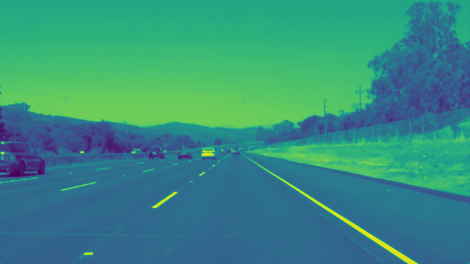
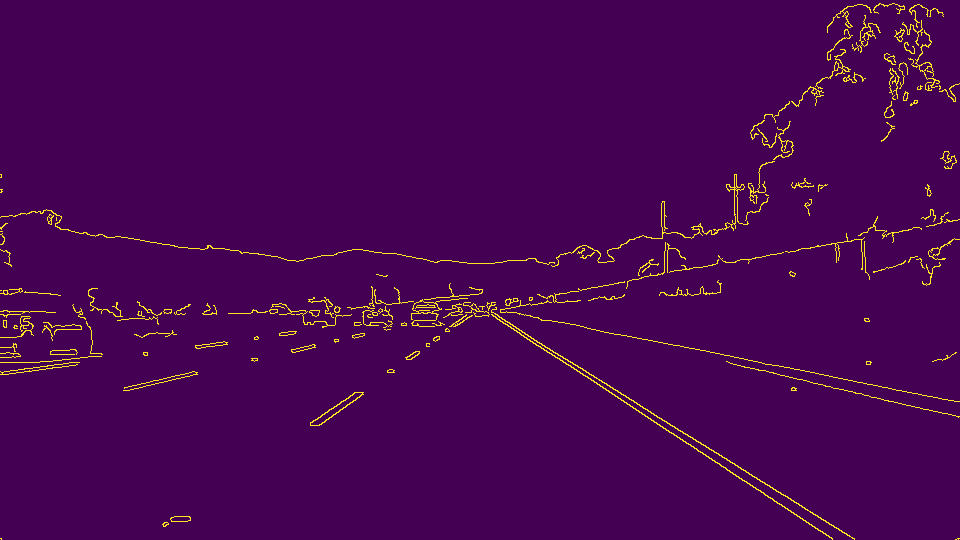
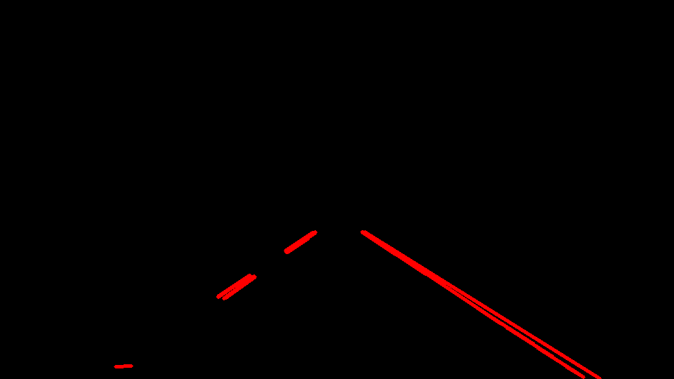
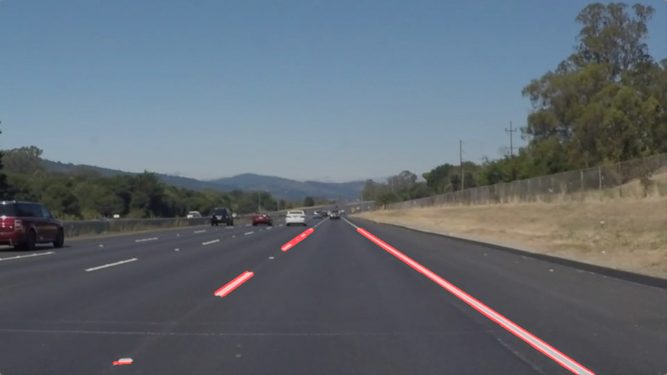
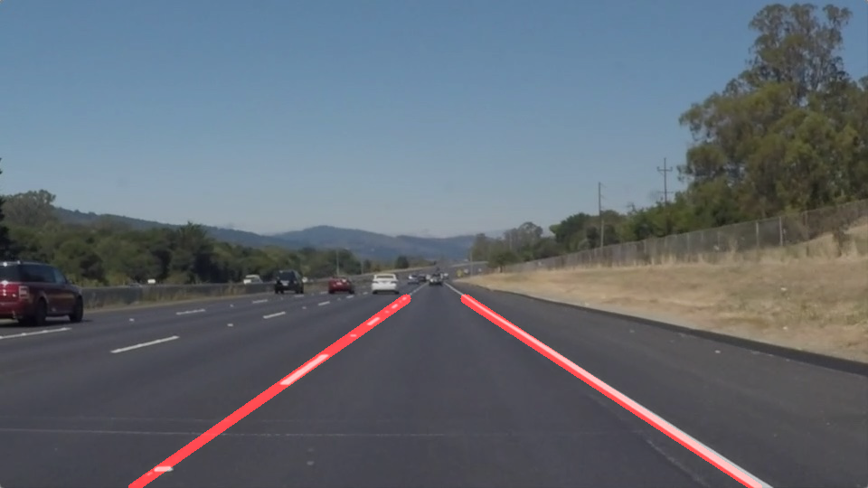

# Finding Lane Lines on the Road

---

## Objective

The objective of this project is to build a pipeline that finds lane lines on the road. In addition, i would use this report to reflect on the key lessons from my work.

---

## Reflection

### 1. Description of the pipeline
The pipeline is developed around the helper/wrapper functions provided by Udacity as a part of the workspace. The pipeline steps would be illustrated with the following image:

My pipeline consisted of the following sequential steps:
1. First, the input images are converted to grayscale

2. Next, a gaussian blurring is applied to reduce some spurious edges, thereby reducing the amount of noise present in the image. 

3. After this, the Canny transform is applied to get the gradient edges. The thresholds for the gradients and the kernel size were anchored on the values which was discussed in the course. The traffic scenario and the color scheme looked very similar to the image discussed in the course

4. A trapeziodal region at the lower center of the image was defined to mask out the lanes. By analysing (trial and error method) the given images and videos, a lit of padding was added and removed to the trapezoid to get the best possible region of interest.

5. A Hough transform is applied on the masked edges. The parameters were determined based on the trial and error method. The length of longer lane segments in the images were used as an anhoring point to decide `min_line_length` and `max_line_gap` .

6. The resulting straight lines from the Hough transform are blended into the source image to derive the target image.

7. In the next improvement step, the lane segments highlighted in the left lane and right lane are drawn as single line in the `draw_lines_extended` function. 
- The end points (x1, y1, x2, y2) of each line segments from the hough tranform are consolidated in separate arrays. Based on the direction of the slope, the points are clustered in seperate arrays. 
- Using `cv2.polyfit` , the slope and y-intercept for the left lane and right lane are derived
- A straight line is drawn from the left bottom to the top left point (which is modelled from the slope and the y-intercept derived from the previous step)
- A similar line is drawn for the right lane.
- A sample output from the above function:

---
### 2. Identify potential shortcomings with your current pipeline

1. The paramters for Canny and Hough Transforms were derived based on a trial and error approach. The functions performance is therefor not scable for a wider use-cases.
2. The region of interest (ROI) is also a fixed region. When the image resolution changes, the ROI needs to be adapted. 
3. When detecting the lanes, i used a straight line fit for modelling the points. This is not practical in many road scenarios. As seen in the challenge.mp4, the function performs poorly around corner or when the camera sees  the lanes from a different angle. So the function is not robust enough for typical driving scenarios.

### 3. Suggest possible improvements to your pipeline

1. A possible improvement would be to improve the robbustness of the curve fitting model. Instead of a first degree polynomial, i would fit a second degree polynomial.
2. Another potential improvement could be the use GUI helper tools to make the parameter fitting more robust. As suggested in the class notes, I would develop a tool like the [one developed by Maunesh Ahir](https://www.youtube.com/watch?v=xdiekchp-Uc)
3. Last but not least, I would need to find a way to automatically estimate the region of interest based on the image resolution and the road scenario. There should be a better way than the hard-coded trapezoid.